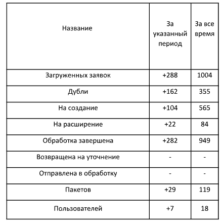

# Проект - Тестовое задания для газпром

## Описание проекта
Имеется xlsx файл, данные которого необходимо сохранить в БД
После чего сформировать на основе данных в бд отчет, пример отчета представлен ниже

  

## Структура проекта
```bash
├─── sender/
│   ├─── report_api/
│   │   ├─── migrations/
│   │   │   ├─── 0001_initial.py
│   │   │   └─── __init__.py
│   │   ├─── tests/
│   │   │   ├─── test_files/
│   │   │   │   └───testing_data.xslx
│   │   │   ├─── test_model.py
│   │   │   ├─── test_serializer.py
│   │   │   └─── test_views.py
│   │   ├─── __init__.py
│   │   ├─── admin.py
│   │   ├─── apps.py
│   │   ├─── models.py
│   │   ├─── producer.py
│   │   ├─── serializers.py
│   │   ├─── tests.py
│   │   ├─── urls.py
│   │   └─── views.py
│   ├─── sender/
│   │   ├─── __init__.py
│   │   ├─── asgi.py
│   │   ├─── settings.py
│   │   ├─── urls.py
│   │   └─── wsgi.py
│   ├─── utils/
│   │   ├───__init__.py
│   │   ├───async_file.py
│   │   ├───report_generate.py
│   │   └─── wrappers.py
│   ├─── Dockerfile
│   ├─── entrypoint.sh
│   ├─── manage.py
│   ├─── pytest.ini
│   └─── requirements.txt
├─── .env
├─── .gitignore
├─── Readme.md
└─── docker-compose.yml
```

## Описание решения
### Приложения
В данном проекте имеется одно приложение
- report_api

В данном приложении реализовано два представления
- получение файла, обработка и сохранение данные (post)
- генерация отчета на основе данных из бд (get)

Оба представления используют асинхронный подход при помощи 
- ```asgyref```
- ```adrf```

####  Описание представлений

#### POST /report

**Описание:** Эта конечная точка позволяет пользователям загружать CSV файл для обработки.

**Запрос:**

- **URL:** `/report/upload`
- **Метод:** `POST`
- **Content-Type:** `multipart/form-data`
- **Параметры:**
  - `file` (form-data): CSV файл, который нужно загрузить. Файл должен быть в формате XLSX.

**Ответы:**

- **201 Created:** CSV файл успешно обработан.
  ```json
  {
    "status": "success"
  }
  ```
- **400 Bad Request:** Неверный ввод или файл не предоставлен.
  ```json
  {
    "error": "No file provided"
  }
  ```
- **422 Unprocessable Entity:** Отсутствуют необходимые поля в CSV файле.
  ```json
  {
    "error": "Missing required fields: field1, field2"
  }
  ```

**Дополнительная информация:**

Данный метод для асинхронного чтения файлов использует класс **ReadCsv** ``utils/async_files.py`` для чтения файлов.

Для обеспечения асинхронности и неблокируемости потока используется самописная функцию **run_in_thread_pool** ``utils/wrappers.py``


#### GET /report

**Описание:** Эта конечная точка позволяет пользователям генерировать отчет в формате Excel.

**Запрос:**

- **URL:** `/report/generate`
- **Метод:** `GET`
- **Параметры:**
  - `start_date` (query): Начальная дата для отчета в формате строки.
  - `end_date` (query): Конечная дата для отчета в формате строки.

**Ответы:**

- **200 OK:** Отчет в формате Excel успешно сгенерирован.
  - Тип содержимого: `application/vnd.openxmlformats-officedocument.spreadsheetml.sheet`
  - Заголовок Content-Disposition: `attachment; filename=report.xlsx`
- **422 Unprocessable Entity:** Неверный диапазон дат.
  ```json
  {
    "error": "Invalid date range"
  }
  ```

**Дополнительная информация:**

Данный метод для генерации использует класс **ExcelReportGenerator** ``utils/report_generate.py`` для генерации отчета.

Для обеспечения асинхронности и неблокируемости потока используется самописная функцию **run_in_thread_pool** ``utils/wrappers.py``

### Тестирование

Для проведения тестирования проекта выполните следующие шаги:

1. Перейдите в директорию `sender`:

    ```bash
    cd sender
    ```

2. Запустите команду `pytest` для выполнения тестов:

    ```bash
    pytest
    ```

**!!! ВАЖНО**

Чтобы тестирование прошло корректно, необходимо установить все зависимости из файла `requirements.txt`, который находится в папке `sender`. Вы можете установить зависимости с помощью следующей команды:

```bash
pip install -r requirements.txt
```

## Развертывание

### Документация по развертыванию

В этом разделе описываются шаги по развертыванию вашего проекта с использованием Docker и Docker Compose. Следуйте инструкциям ниже для корректного развертывания приложения.


### Файл docker-compose.yml

`docker-compose.yml` файл:

```yaml
version: '3.7'

services:
  postgres:
    image: postgres:14-alpine
    container_name: gazprom-pg
    restart: always
    environment:
      - POSTGRES_USER=${DB_USER}
      - POSTGRES_PASSWORD=${DB_PASSWORD}
      - POSTGRES_DB=${DB_NAME}
    ports:
      - ${DB_PORT}:5432
    volumes:
      - ./postgres-data:/var/lib/postgresql/data
    networks:
      - gazprom-net

  backend:
    build: 
      context: ./sender
      dockerfile: Dockerfile
    container_name: gazprom-back
    command: "uvicorn sender.asgi:application --host 0.0.0.0 --port 8000 --reload"
    restart: always
    env_file:
      - .env
    ports:
      - ${SERVER_PORT}:8000
    networks:
      - gazprom-net
    depends_on:
      - postgres

networks:
  gazprom-net:
    driver: bridge
```

### Файл Dockerfile

`Dockerfile`:

```Dockerfile
# Используем официальный образ Python
FROM python:3.11.9-slim-bookworm

WORKDIR /app

RUN apt-get update && apt-get install -y \
    libpq-dev \
    gcc \
    netcat-openbsd \
 && apt-get clean \
 && rm -rf /var/lib/apt/lists/*

COPY requirements.txt /app/
RUN pip install --no-cache-dir -r requirements.txt

COPY . /app/

ENV DJANGO_SETTINGS_MODULE=sender.settings
ENV PYTHONUNBUFFERED=1

RUN python manage.py collectstatic --noinput

COPY ./entrypoint.sh /app/entrypoint.sh
RUN chmod +x /app/entrypoint.sh

EXPOSE 8000

ENTRYPOINT ["/app/entrypoint.sh"]
```

### Файл entrypoint.sh

`entrypoint.sh`:

```sh
#!/bin/sh

# Проверяем доступность базы данных перед выполнением миграций
echo "Waiting for postgres..."

while ! nc -z $DB_HOST $DB_PORT; do
  sleep 0.1
done

echo "PostgreSQL started"

# Выполнение миграций (на случай, если их нужно выполнить при запуске контейнера)
python manage.py migrate --noinput

# Запуск приложения
exec "$@"
```

### Шаги для развертывания

1. **Клонируйте репозиторий:**

    ```bash
    git clone https://github.com/your-repo/your-project.git
    cd your-project
    ```

2. **Файл `.env`:**

    В корневом каталоге проекта имеется файл `.env` при необходимости его можно редактировать:
    ```env
      PROD=True
      SERVER_PORT=55550

      DB_NAME=GAZPROM
      DB_USER=sa
      DB_PASSWORD=12345678
      DB_HOST=postgres
      DB_PORT=5432
    ```

3. **Соберите и запустите контейнеры:**

    Используйте Docker Compose для сборки и запуска контейнеров:

    ```bash
    docker-compose --env-file .env up -d
    ```

4. **Проверка доступности приложения:**

    После успешного развертывания приложение будет доступно по адресу `http://localhost:55550`.
    Документация API будет доступна по адресу `http://localhost:55550/swagger/` 


### Заключение

Следуя этим инструкциям, вы сможете успешно развернуть и протестировать ваше приложение. Если у вас возникнут вопросы или проблемы, пожалуйста, обратитесь к документации или поддержке.

---


